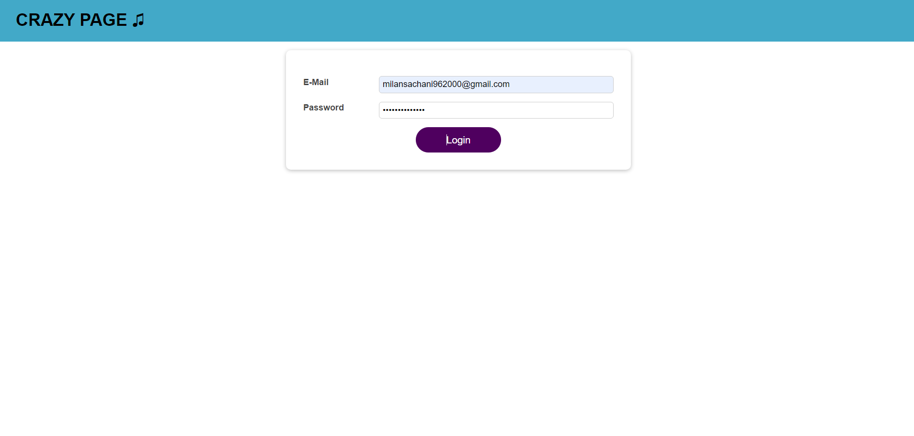

### DUMMY_LOGIN_PAGE 

In this App, I have created a DUMMY_LOGIN_PAGE where I have used Authentication for front-end without any backend platform for react. You have to enter your EMAIL_ID and PASSWORD for logged in.

